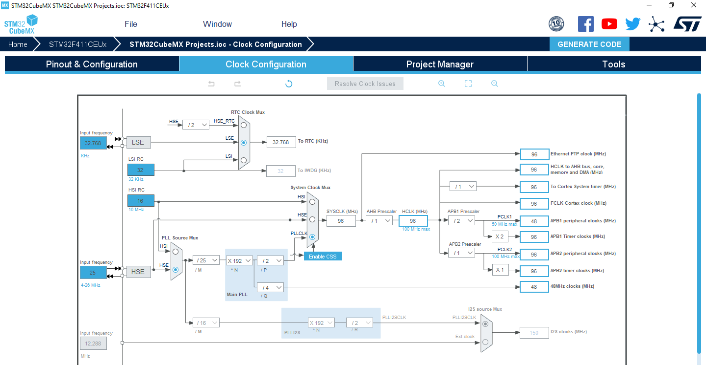

# STM32CubeMX Empty Makefile Projects

This repository provides empty Makefile-based projects created with STM32CubeMX.

To prevent code duplication, the STM32CubeFx material included by STM32CubeMX has been removed from the generated code and made available as a Git submodule.

## Clock configuration

For a quick glance at the clock configuration used to generate projects, please refer to the media folder.

As example, here's the clock configuration for STM32F411CEUx-based projects:

